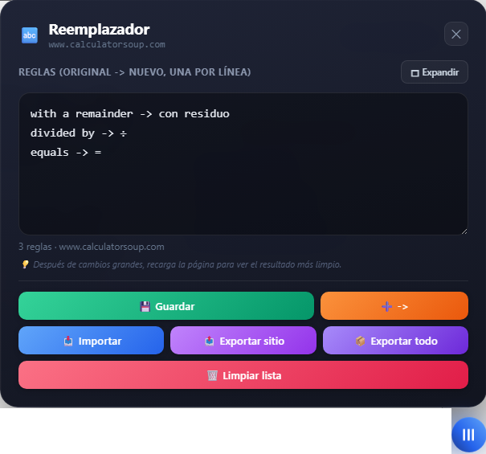

# Reemplazar texto coincidente

**Última Actualización:** 14 de julio de 2026

Reemplaza automáticamente palabras o expresiones en cualquier página compatible mediante reglas personalizadas, con un menú flotante moderno, soporte para expresiones regulares e importación/exportación de configuraciones.



## 📖 Descripción

**Reemplazar texto coincidente** es un UserScript para **Tampermonkey** que permite sustituir automáticamente texto en las páginas web mediante reglas definidas por el usuario.

Cada sitio web mantiene su propia lista de reemplazos, permitiendo personalizar el contenido mostrado sin modificar la página original.

También incorpora herramientas para importar, exportar y administrar fácilmente todas las reglas desde un panel flotante.

---

# 📥 Instalación

1. Instala la extensión **Tampermonkey** para tu navegador.

2. Instala el script desde GitHub:

**➡️ [Instalar Script](https://github.com/wernser412/Reemplazar-texto-coincidente/raw/refs/heads/main/Reemplazar%20texto%20coincidente.user.js)**

---

# ✨ Características

- 🔤 Reemplazo automático de texto.
- 🌐 Reglas independientes para cada sitio web.
- 🔍 Soporte para expresiones regulares (`regex:`).
- ⚡ Procesamiento automático del contenido cargado dinámicamente.
- 🎨 Panel flotante moderno.
- 📝 Editor integrado para administrar reglas.
- 📏 Área de edición redimensionable.
- 💾 Guarda automáticamente las reglas por dominio.
- 📥 Importar reglas desde archivos JSON.
- 📤 Exportar reglas del sitio actual.
- 📦 Exportar todas las reglas de todos los sitios.
- ➕ Botón para insertar rápidamente `->`.
- 📊 Contador de reglas configuradas.
- 🔔 Mensajes visuales para confirmar las acciones.
- ⌨️ Cierre rápido del panel con la tecla **Esc**.

---

# 📝 Sintaxis de las reglas

Cada regla debe escribirse en una línea con el siguiente formato:

```text
texto original -> texto nuevo
```

Ejemplo:

```text
perro -> gato
hola -> adiós
```

También es posible utilizar expresiones regulares:

```text
regex:\d+ -> NÚMERO
```

---

# 🖥️ Uso

1. Abre una página compatible.
2. Pulsa el botón flotante ☰.
3. Escribe las reglas de reemplazo.
4. Guarda los cambios.
5. El texto de la página se reemplazará automáticamente.

---

# 💾 Información almacenada

El script recuerda automáticamente:

- Reglas de reemplazo por cada dominio.
- Altura del editor de reglas.
- Visibilidad del botón flotante.

---

# 📤 Importación y exportación

El panel permite:

- 📥 Importar configuraciones desde un archivo JSON.
- 📤 Exportar únicamente las reglas del sitio actual.
- 📦 Exportar todas las reglas almacenadas en un único archivo.

Esto facilita crear copias de seguridad o compartir configuraciones entre equipos.

---

# 📄 Sitios compatibles

Actualmente el script está configurado para funcionar en:

- OnlineMSchool
- CalculatorSoup

Es posible ampliar fácilmente la lista añadiendo nuevos dominios en el UserScript.

---

# 📄 Licencia

Este proyecto se distribuye bajo la licencia **MIT**.

Consulta el archivo **LICENSE** para más información.
